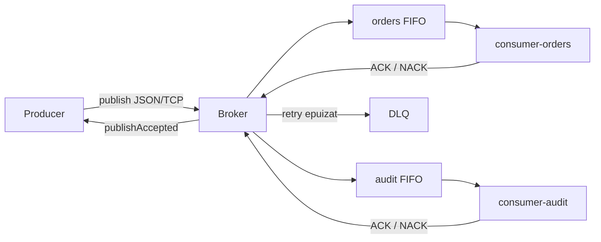

# Arhitectura sistemului

```mermaid
flowchart LR
 P[Producer] -->|publish JSON/TCP| B[Broker]
 B -->|publishAccepted| P
 B --> Q1[orders FIFO]
 B --> Q2[audit FIFO]
 Q1 --> C1[consumer-orders]
 Q2 --> C2[consumer-audit]
 C1 -->|ACK / NACK| B
 C2 -->|ACK / NACK| B
 B -->|retry epuizat| D[DLQ]
```
Rutarea folosește `destination`. Există un Consumer activ per destinație. FIFO este garantat în cadrul unei destinații; `orders` și `audit` sunt independente.
