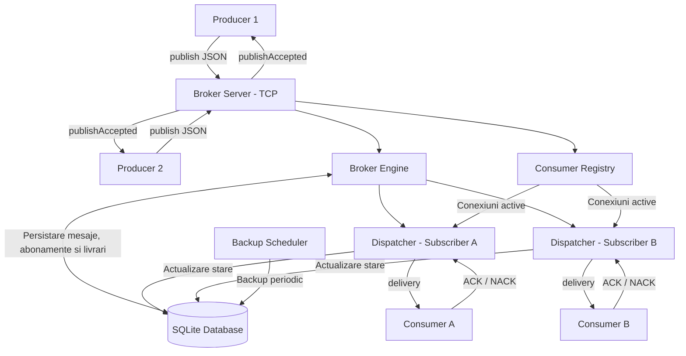

# Arhitectura sistemului

Sistemul implementează un mecanism de comunicare asincronă de tip **Publish–Subscribe**, utilizând conexiuni TCP, mesaje JSON și persistență SQLite.

Arhitectura este modulară și separă responsabilitățile de publicare, distribuire, procesare și stocare a mesajelor.

## Diagrama arhitecturii

## Componentele principale

**Producer** — creează și transmite mesaje către Broker prin TCP. În cazul unei erori de comunicare, mecanismul `ReliableProducer` poate retransmite același mesaj, păstrând identificatorul acestuia.

**BrokerServer** — primește conexiunile TCP și gestionează operațiile de publicare, înregistrare și dezabonare.

**BrokerEngine** — coordonează persistarea mesajelor și distribuirea lor către Subscriber-ii activi.

**ConsumerRegistry** — gestionează conexiunile active ale Consumer-ilor pentru fiecare topic.

**Dispatcher per Subscriber** — preia livrările eligibile din SQLite și transmite mesajele către Consumer-ul corespunzător. Fiecare Subscriber are propria stare de livrare.

**Consumer** — procesează mesajele, verifică duplicatele și transmite ACK sau NACK. Poate încerca reconectarea după pierderea conexiunii.

**SQLite** — păstrează mesajele, abonamentele și stările livrărilor în tabelele `messages`, `subscriptions` și `deliveries`.

**BackupScheduler** — execută periodic operații de backup asupra bazei de date, utilizând serviciul dedicat de backup.

## Fluxul unui mesaj

1. Producer-ul transmite un mesaj JSON către Broker.
2. Broker-ul validează mesajul și îl persistă în SQLite.
3. Pentru Subscriber-ii activi ai topicului sunt create livrări independente.
4. Broker-ul confirmă acceptarea publicării prin `publishAccepted`.
5. Dispatcher-ul fiecărui Subscriber identifică livrările disponibile și transmite mesajele prin TCP.
6. Consumer-ul procesează mesajul și trimite ACK sau NACK.
7. Broker-ul actualizează starea livrării în SQLite.
8. În cazul eșecurilor, mesajul poate fi reîncercat sau marcat `DEAD_LETTER` după epuizarea numărului maxim de încercări.

## Persistență și toleranță la erori

Stările principale ale livrărilor sunt:

- `PENDING` — livrarea a fost creată și așteaptă procesarea.
- `IN_FLIGHT` — mesajul este în curs de livrare.
- `ACKED` — Consumer-ul a confirmat procesarea.
- `RETRY_PENDING` — livrarea a eșuat și este programată pentru reîncercare.
- `DEAD_LETTER` — numărul maxim de încercări a fost epuizat.
- `CANCELLED` — livrarea a fost anulată în urma dezabonării.

La repornirea Broker-ului, livrările rămase în starea `IN_FLIGHT` pot fi recuperate pentru o nouă încercare.

## Semantica livrării

Sistemul urmărește semantica **at-least-once**: un mesaj poate fi retransmis dacă procesarea a avut loc, dar confirmarea ACK nu a ajuns la Broker.

Pentru reducerea efectelor duplicate, Consumer-ul utilizează un mecanism de deduplicare bazat pe identificatorul mesajului.

Nu este garantată procesarea globală strict FIFO în prezența retransmiterilor, reconectărilor și a mai multor Subscriber-i.

## Exemplu practic

Un Producer publică un mesaj `OrderCreated` pe topicul `orders`.

Dacă doi Consumer-i sunt abonați la acest topic, Broker-ul creează două livrări independente. Fiecare Consumer poate confirma procesarea separat, iar o eroare la unul dintre ei nu anulează confirmarea celuilalt.

Această abordare permite distribuirea evenimentelor către mai multe componente ale aplicației, păstrând istoricul și starea fiecărei livrări.