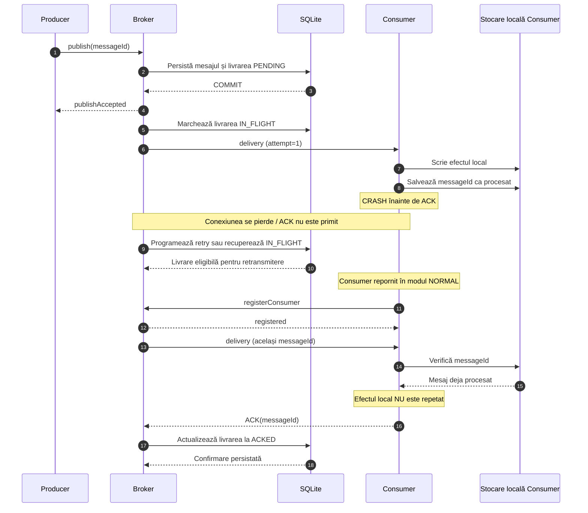

# Diagrama de secvență — Crash Before ACK

Această diagramă prezintă scenariul în care un Consumer procesează un mesaj și realizează efectul local, dar se oprește înainte să trimită confirmarea ACK către Broker.

Scenariul evidențiază semantica de livrare **at-least-once**, persistența mesajelor și utilizarea deduplicării pentru evitarea repetării efectului local.

## Diagrama de secvență

## Explicația scenariului

1. Producer-ul transmite un mesaj către Broker, identificat printr-un `messageId` unic.
2. Broker-ul persistă mesajul și creează în SQLite înregistrările de livrare pentru Subscriber-ii activi.
3. După confirmarea tranzacției, Broker-ul răspunde Producer-ului cu `publishAccepted`.
4. Dispatcher-ul marchează livrarea `IN_FLIGHT` și transmite mesajul către Consumer.
5. Consumer-ul execută efectul local și salvează identificatorul mesajului în `DeduplicationStore`.
6. Simulăm oprirea neașteptată a procesului Consumer înainte de transmiterea ACK-ului.
7. Broker-ul detectează eșecul conexiunii sau lipsa confirmării și programează o nouă încercare. Dacă Broker-ul este repornit, livrările rămase `IN_FLIGHT` sunt recuperate.
8. Consumer-ul repornește în modul normal, folosind aceeași identitate și aceleași fișiere locale de deduplicare.
9. La retransmiterea mesajului, Consumer-ul identifică `messageId` deja procesat și nu repetă efectul local.
10. Consumer-ul trimite ACK, iar Broker-ul persistă starea `ACKED`.

## Semantica livrării

Sistemul implementează o abordare **at-least-once**, în care un mesaj poate fi livrat de mai multe ori dacă confirmarea procesării nu este primită.

Deduplicarea permite evitarea repetării efectelor locale pentru mesajele deja procesate.

Aceasta nu reprezintă o garanție generală de tip *exactly-once*. În special, efectul local și înregistrarea identificatorului procesat sunt operații separate și nu formează o singură tranzacție atomică.

## Concluzie

Scenariul demonstrează diferența dintre acceptarea unui mesaj de către Broker și confirmarea procesării sale de către Consumer.

Persistența SQLite permite recuperarea livrărilor, iar deduplicarea contribuie la procesarea idempotentă în cazul retransmiterilor.