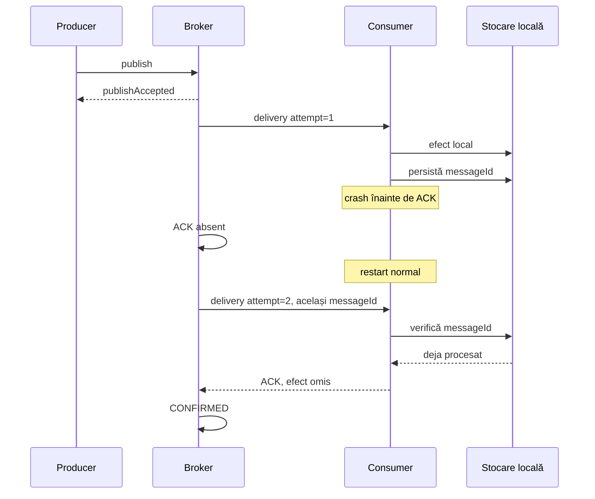

# Diagrama de secvență - crash-before-ACK

```mermaid
sequenceDiagram
 participant P as Producer
 participant B as Broker
 participant C as Consumer
 participant S as Stocare locală
 P->>B: publish
 B-->>P: publishAccepted
 B->>C: delivery attempt=1
 C->>S: efect local
 C->>S: persistă messageId
 Note over C: crash înainte de ACK
 B->>B: ACK absent
 Note over C: restart normal
 B->>C: delivery attempt=2, același messageId
 C->>S: verifică messageId
 S-->>C: deja procesat
 C-->>B: ACK, efect omis
 B->>B: CONFIRMED
```
Scenariul demonstrează at-least-once + deduplicare, nu exactly-once.
