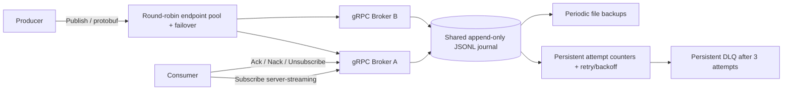

# gRPC architecture

```mermaid
flowchart LR
  P[Producer] -->|Publish / protobuf| LP[Round-robin endpoint pool + failover]
  LP --> B1[gRPC Broker A]
  LP --> B2[gRPC Broker B]
  B1 --> J[(Shared append-only JSONL journal)]
  B2 --> J
  C[Consumer] -->|Subscribe server-streaming| B1
  C -->|Ack / Nack / Unsubscribe| B1
  J --> R[Persistent attempt counters + retry/backoff]
  R --> Q[Persistent DLQ after 3 attempts]
  J --> BK[Periodic file backups]
```

The shared journal must be on a filesystem with reliable cross-process file locking. Separate local journals do not form
a coherent load-balanced broker cluster.